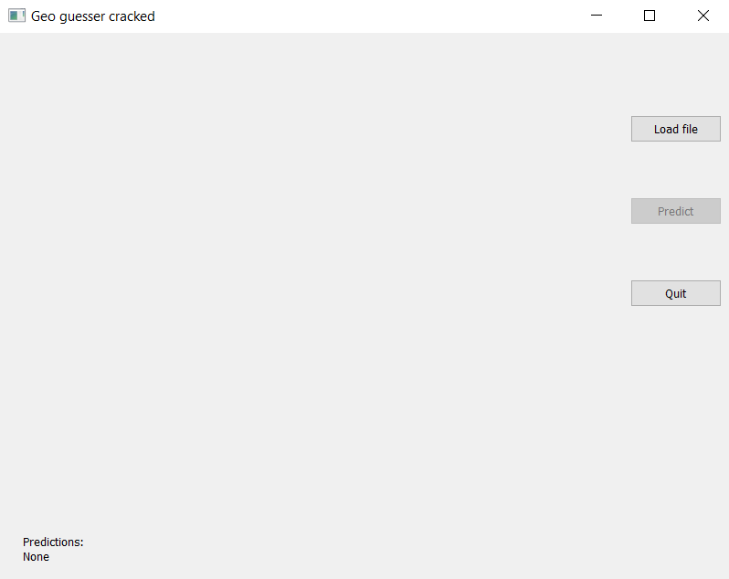
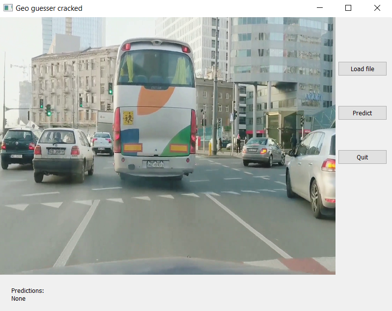
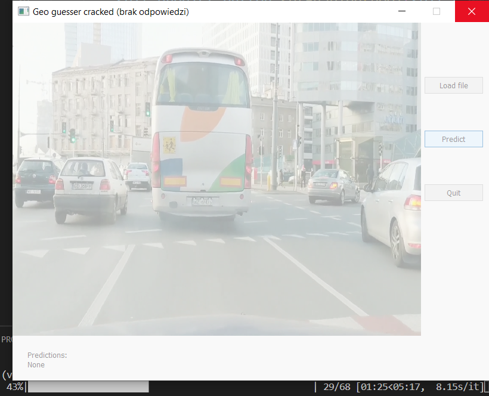
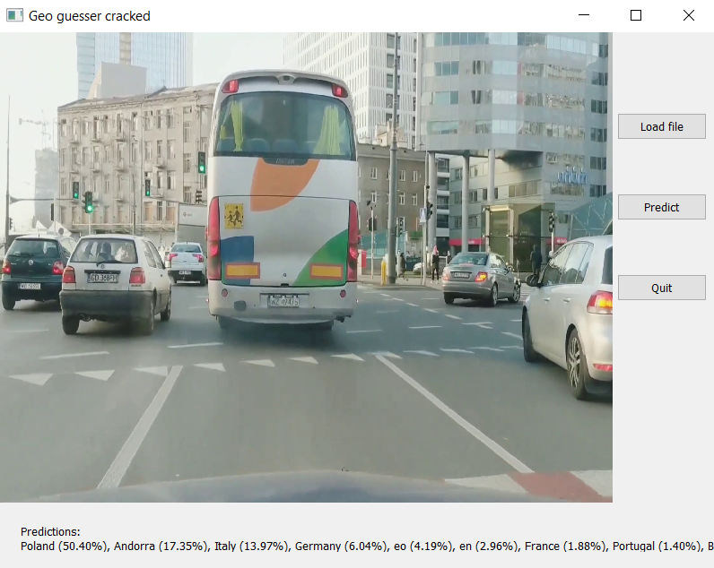
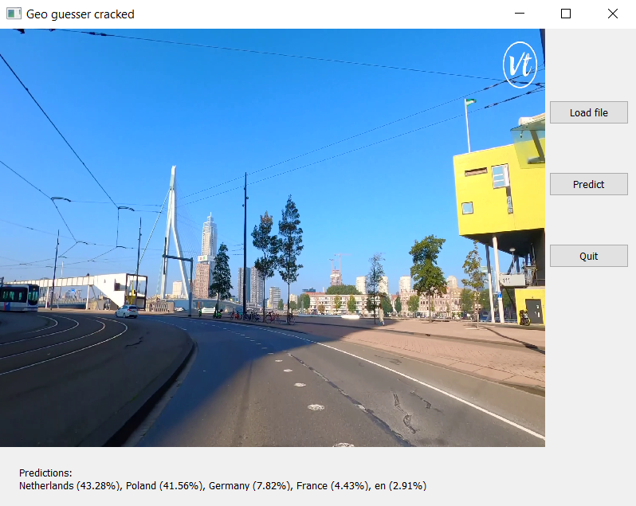
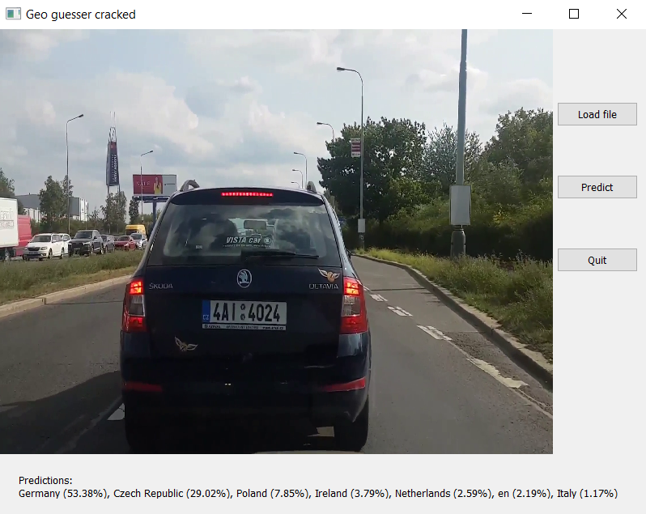

# GeoGuesser cracked

## Spis treści
1. [Temat projektu](#subject)
1. [Realizacja](#impl)
    1. [Moduł wykrywania tekstu](#text_detection)
    1. [Moduł wykrywania języka](#language_detection)
    1. [Moduł wykrywania kodu z tablic rejestracyjnych](#car_plate_detection)
    1. [Łączenie pośrednich wyników w ostateczny](#final_results)
1. [Interfejs użytkownika (instrukcja obsługi)](#gui)
1. [Użyte technologie](#technologies)
1. [Zestaw danych i przykładowe wyniki](#dataset)
1. [Jak uruchomić projekt?](#run)
1. [Wnioski](#concl)
1. [Autorzy](#authors)

---
---

## 1. Temat projektu 

Celem projektu było stworzenie prostej aplikacji umożliwiającej predykcję lokalizacji na podstawie filmu wideo (preferowany format: *mp4*).  
Aktualna wersja aplikacji radzi sobie dobrze tylko dla filmów z krajów europejskich.

---

## 2. Realizacja 

Algorytm przewidywania lokalizacji składa się z kilku modułów. W celu przyspieszenia zdecydowano się na analizowanie co kilku klatek (liczba ta uzależniona jest od stałej `EVERY_N_FRAME`; wszystkie stałe znajdują się w pliku `app/constants.py`). 

### 2.1. Moduł wykrywania tekstu 

W celu wykrycia tekstu skorzystano z narzędzia do optycznego rozpoznawania znaków (OCR) - Pytesseract. Potrafi on czytać i rozpoznawać tekst na obrazach i jest powszechnie używany w obrazach do wykrywania tekstu. Obsługuje szeroką gamę języków. Dla zwiększenia efektywności obrazy powinny być wstępnie przetworzone. Klatki zostały przekonwertowane do skali szarości, a następnie zmodyfikowane za pomocą filtru Gaussa.
Minimalna wymagana długość słowa jest określona przez `MIN_WORD_LENGTH`.

### 2.2. Moduł wykrywania języka 

Do modułu odpowiedzialnego za wykrywania języka wykorzystano biblioteki fastText oraz PyCountry. FastText jest biblioteką opracowaną przez zespół firmy Facebook. Pozwala na klasyfikację tekstu wykorzystując hierachiczne klasyfikatory. Główną zaletą tej biblioteki jest liczba obsługiwanych języków - obecnie 176.
FastText udostępnia 2 modele do predykcji języka - skompresowany z mniejszą dokładnością oraz pełny. Oba został wytrenowane z wykorzystaniem danych z serwisów takich jak Wikipedia czy Tatoeba. 
Importując pretrenowany model jesteśmy w stanie (z pewnym błędem) mapować wybraną sekwencję znaków na kod ISO wykrytego języka.  
Język angielski występuje powszechnie, dlatego zdecydowano się na osłabienie jego wagi (stała `WEAKEN_ENGLISH_CONTANT`). Dodatkowo prawdopodobieństwo wykrytego języka nie może być mniejsze niż określone przez `LANGUAGE_ACCURACY_THRESHOLD`, a całkowita liczba wykryć danego języka powinna być równa co najmniej `MINIMAL_NUMBER_OF_LANGUAGE_ENTRIES` razy.

### 2.3. Moduł wykrywania kodu z tablic rejestracyjnych 

Wykorzystano funkcje biblioteki OpenCV w połączeniu z klasyfikatorem Haara. W pierwszej fazie na obrazie/klatce wyszukiwana jest tablica rejestracyjna. Jeśli zostanie znaleziona, to następuje ekstracja tekstu za pomocą modułu omówionego wcześniej. Wówczas numer z tablicy pobrany w ten sposób jest przetwarzany w poszukiwaniu kraju z jakiego może pochodzić. W tym celu posłużono się hiszpańską stroną *https://www.ofesauto.es/en/know-the-nationality-of-a-vehicle-through-its-plate-number/*, która pomaga w identyfikacji kraju, zwracając dane prawdopodobieństwo (przyjęty minimalny próg dokładności jest ustalony przez `PLATE_CODE_ACCURACY_THRESHOLD`). Wyniki są scrapowane i przesyłane dalej do funkcji zwracającej ostateczne wyniki.

### 2.4. Łączenie pośrednich wyników w ostateczny 

Wyniki trzymane są w słownikach jako pary/tuple: `(nazwa kraju, zsumowane prawdopodobieństwo)`. Kody ISO krajów są wcześniej konwertowane na pełne nazwy z wyjątkiem języków na podstawie, których nie da się jednoznacznie określich kraju, np. angielski - `en`. Słowniki są łączone w jeden względem kluczy w taki sposób, że dodawane są do siebie zsumowane prawdopodobieństwa. Wówczas powstaje jeden słownik wynikowy, na podstawie którego wyliczane jest (po uprzedniej normalizacji) końcowe prawdopodobieństwo.

---

## 3. Interfejs użytkownika (instrukcja obsługi) 

1. Uruchom aplikację (*zobacz [Jak uruchomić projekt?](#run)*)
1. Wczytaj film za pomocą przycisku `Load file`
1. Po załadowaniu naciśnij `Precict`. 
**Uwaga!** Proces predykcji może zająć kilka(naście) minut.
1. Wynik końcowy pojawi się na dole ekranu aplikacji. 
1. Aby zamknąć aplikację, użyj przycisku `Quit`.

|  |
|:--:|
| Ekran startowy aplikacji |

|  |
|:--:|
| Ekran aplikacji po załadowaniu filmu |

|  |
|:--:|
| Ekran aplikacji w czasie przetwarzania (na dole pasek postępu widoczny w konsoli) |

---

## 4. Użyte technologie 

  a także:
* [Beautiful Soup 4](https://pypi.org/project/beautifulsoup4/)
* [tqdm](https://tqdm.github.io/) 
* [PyQt](https://pythonpyqt.com/)
* [requests](https://pypi.org/project/requests/)
* [fastText](https://fasttext.cc/)
* [PyCountry](https://pypi.org/project/pycountry/)

---

## 5. Zestaw danych i przykładowe wyniki 

Dane zostały zebrane w katalogu [`dataset`](./app/dataset/) z filmów udostępnionych na platformie YouTube i wycięto z nich najbardziej znaczące momenty. 
* Rotterdam - https://www.youtube.com/watch?v=P_WmMAL9OoU
* Warszawa - https://www.youtube.com/watch?v=2TerKs9YwoM
* Praga - https://www.youtube.com/watch?v=FIltxaXz9Ng
* Frankfurt - https://www.youtube.com/watch?v=vnqkraiSiTI

|  |
|:--:|
| Wyniki dla pliku *Warsaw.mp4* |

|  |
|:--:|
| Wyniki dla pliku *Rotterdam.mp4* |

|  |
|:--:|
| Wyniki dla pliku *Prague.mp4* |

---

## 6. Jak uruchomić projekt? 

1. Sklonuj repozytorium: `git clone`
1. Wejdź do katalogu *app*: `cd app`
1. Stwórz wirtualne środowisko (preferowana nazwa to `venv` tak, by *gitingore* mógł je pominąć): `py -m venv venv` (lub `python -m venv venv`)
1. Aktywuj stworzone środowisko (dla Windows: `venv\Scripts\activate`)
1. Zaintaluj odpowiednie moduły: `pip install -r requirements.txt`  
Użyj odpowiedniej wersji `fasttext` wheel dla  (zobacz [tu](https://github.com/Haranoi17/AIPO_geoguesser/tree/text_to_language_prediction); *domyślnie ustawione na Windows 64-bitowy*)
1. Uruchom aplikację: `py main.py` (lub `python main.py`)

## 7. Wnioski 

* wykrywanie tekstu, języka jak i numeru rejestracyjnego na obrazie jest kłopotliwym zadaniem i nie zawsze daje pożądane rezultaty
* nawet pomimo poprawnego wykrycia tekstu, języka czy numeru rejestracyjnego, często  nie można jednoznacznie ustalić kraju pochodzenia filmu, np. w przypadku wykrycia języka angielskiego nie można wskazać jednego kraju, w którym obowiązuje ten język albo gdy na filmie zostanie wykrytych dużo rejestracji kojarzonych z innym niż docelowym krajem (czego dowodzi działanie aplikacji na przykładzie filmu z Czech - Pragi)
* aplikacja działa dosyć wolno, nawet pomimo analizowania co piątej klatki, dlatego ten aspekt należałoby zdecydowanie poprawić w przyszłości, stosując wielowątkowość, którą trudno było wprowadzić w obecnej strukturze projektu
* uzyskane wyniki zależą również w dużym stopniu od zastosowanych rozwiązań, a należy podkreślić, że wykorzystano darmowe biblioteki i strony internetowe, które same w sobie bywają zawodne
* potencjalny dalszy rozwój aplikacji wymagałby dopracowania m. in.:
    - wspomnianej już szybkości (dzięki zaimplementowaniu wielowątkowości)
    - interfejsu graficznego
    - kolejnych metod pomagających rozszerzyć zastosowanie aplikacji (np. o wykrywanie krajów z kolejnych kontynentów)

---

## 8. Autorzy 
* [Patryk Śledź](https://github.com/patryk0504)
* [Weronika Ciurej](https://github.com/weronikac)
* [Bartosz Rogowski](https://github.com/bartosz-rogowski)
* [Kinga Pyrek](https://github.com/kingapyrek)
* [Kamil Sudoł](https://github.com/kamilsudol)
* [Kamil Szczepanek](https://github.com/Haranoi17)